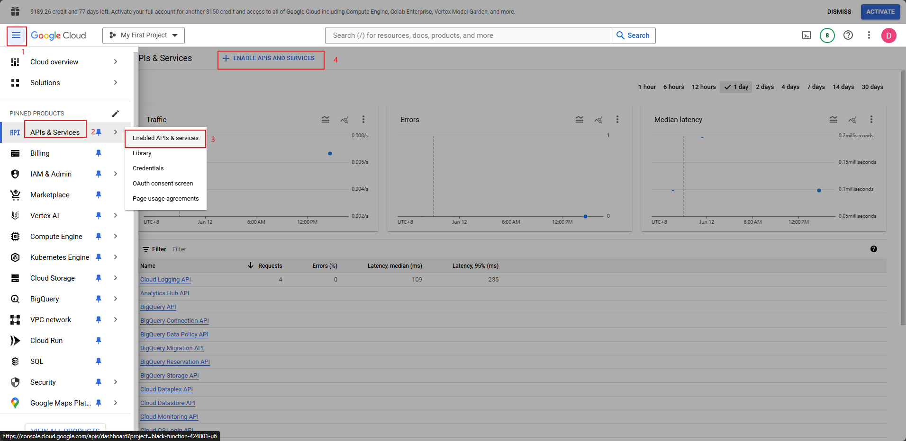
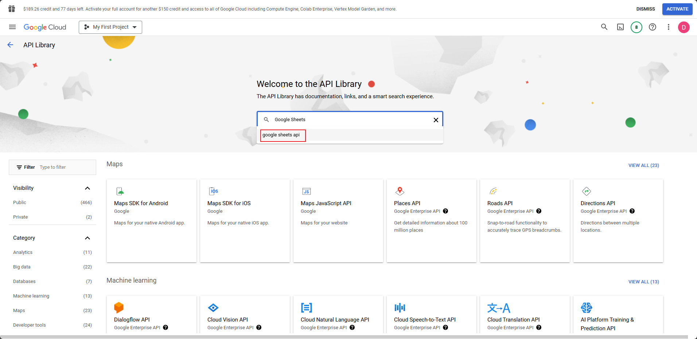
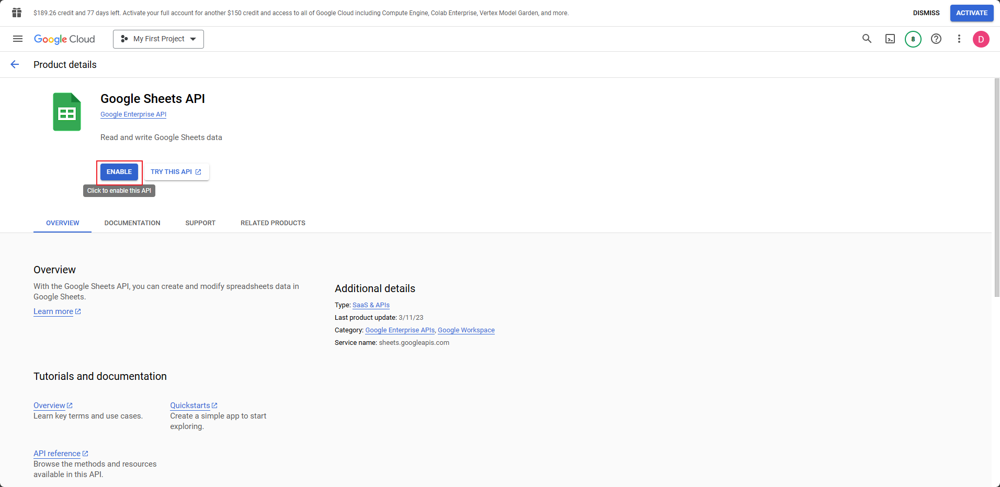
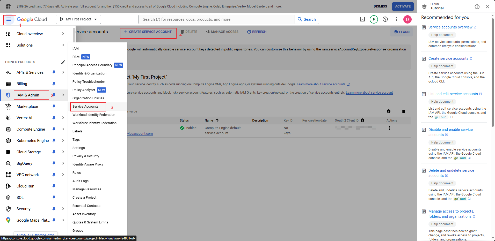
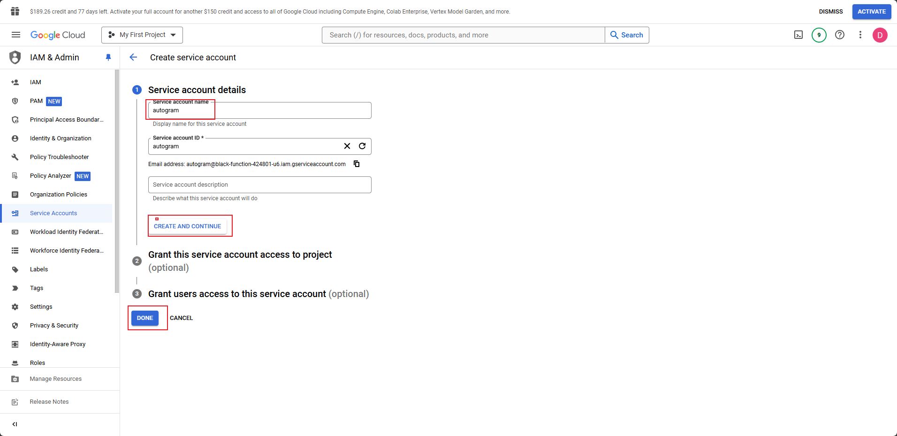
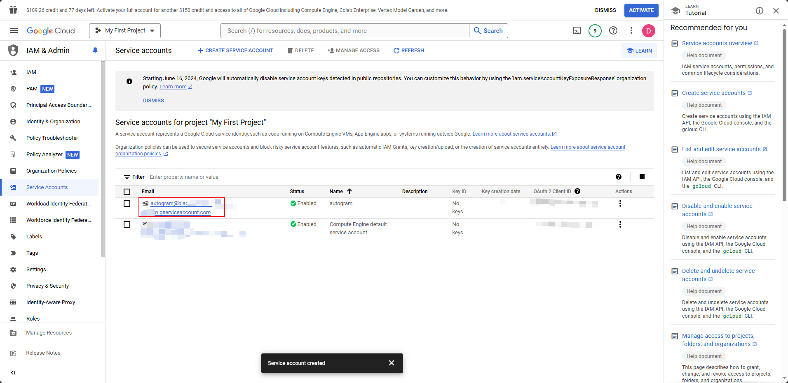
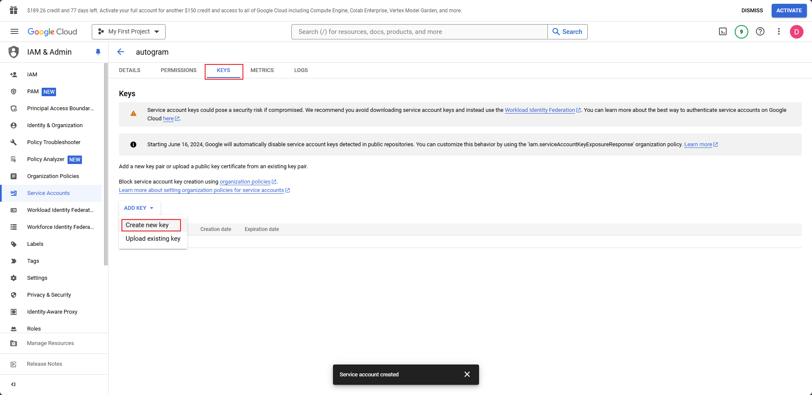
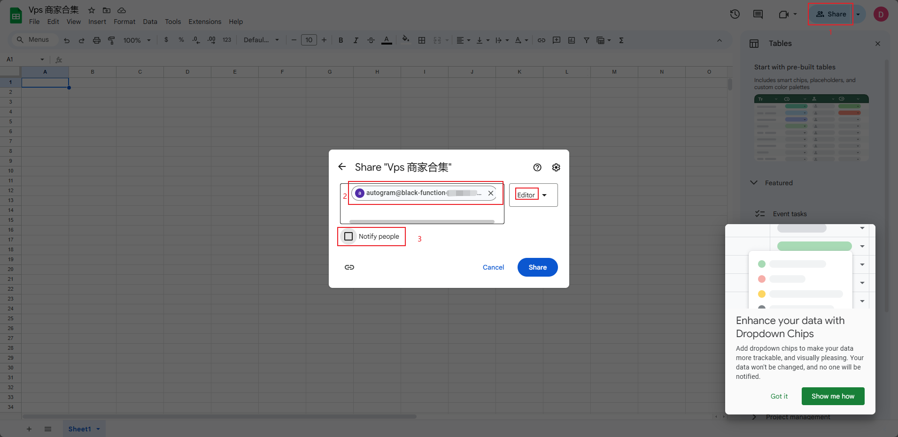

# google-sheets-crud

# 开发

## 获取 google sheets id

使用任意 google 账号在 [https://docs.google.com/spreadsheets/u/0/](https://docs.google.com/spreadsheets/u/0/) 创建一个表格

创建完表格后，查看地址栏，会看到如下地址，最长的那段文本就是 ID
```
https://docs.google.com/spreadsheets/d/1DsoedUDlmsdaDKMAK5sdaM_IInsdaonLOLsda51s/edit#gid=0
```

## 获取 google cloud sheets api 控制

首先，登录 [https://cloud.google.com/](https://cloud.google.com/)

然后去启用 Sheets API

搜索 `Google Sheets`

启用 API

创建一个服务账户，如果已存在服务账户也可以直接使用

创建服务账户，名称可以随意填写，之后点击 `create` 再点 `Done` 即可

点击创建完成的服务账户

创建服务账户的 key

选择 `JSON` ，点击创建，完成后浏览器会自动下载一个json文件

## 将 google cloud 与 sheets 关联起来

进入刚刚创建的 sheets 表格，点击共享，分享给刚刚我们再 gcp 创建的服务账户，账户邮箱可以在我们刚下载的 json 文件中复制出来


## 使用

[google sheets api 说明文档](https://developers.google.com/sheets/api/limits?hl=zh-cn)

1. 将下载的 json 文件重命名为 `service_account.json` 并放到此项目根目录中
2. 将根目录下的 config_example.json 重命名为 config.json ,并修改内部的 sheet_id 改为第一步获取的 sheet 表格 ID
3. 现在你可以启动项目了